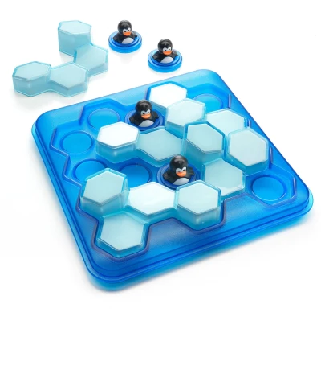
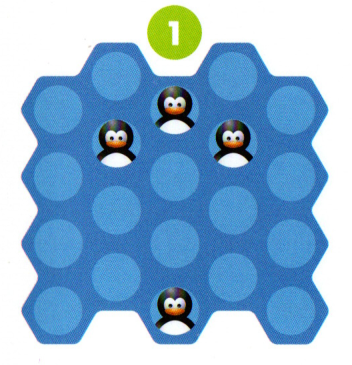
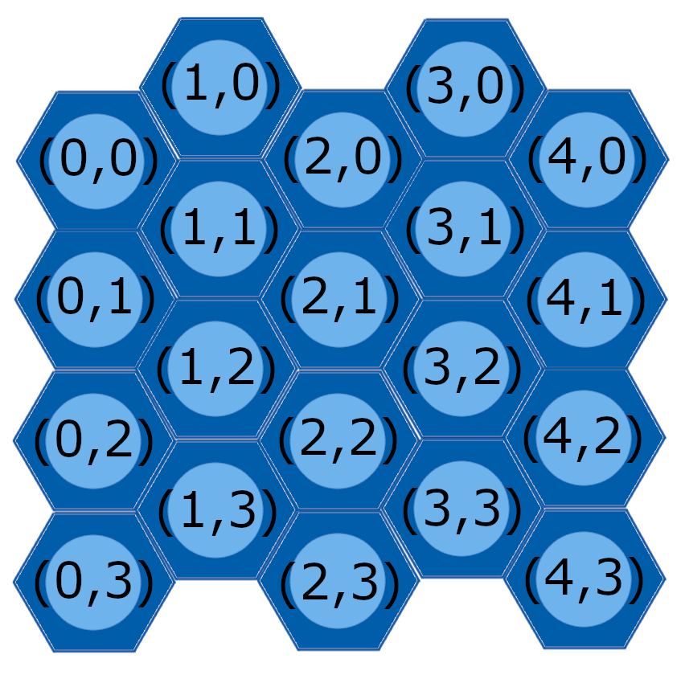
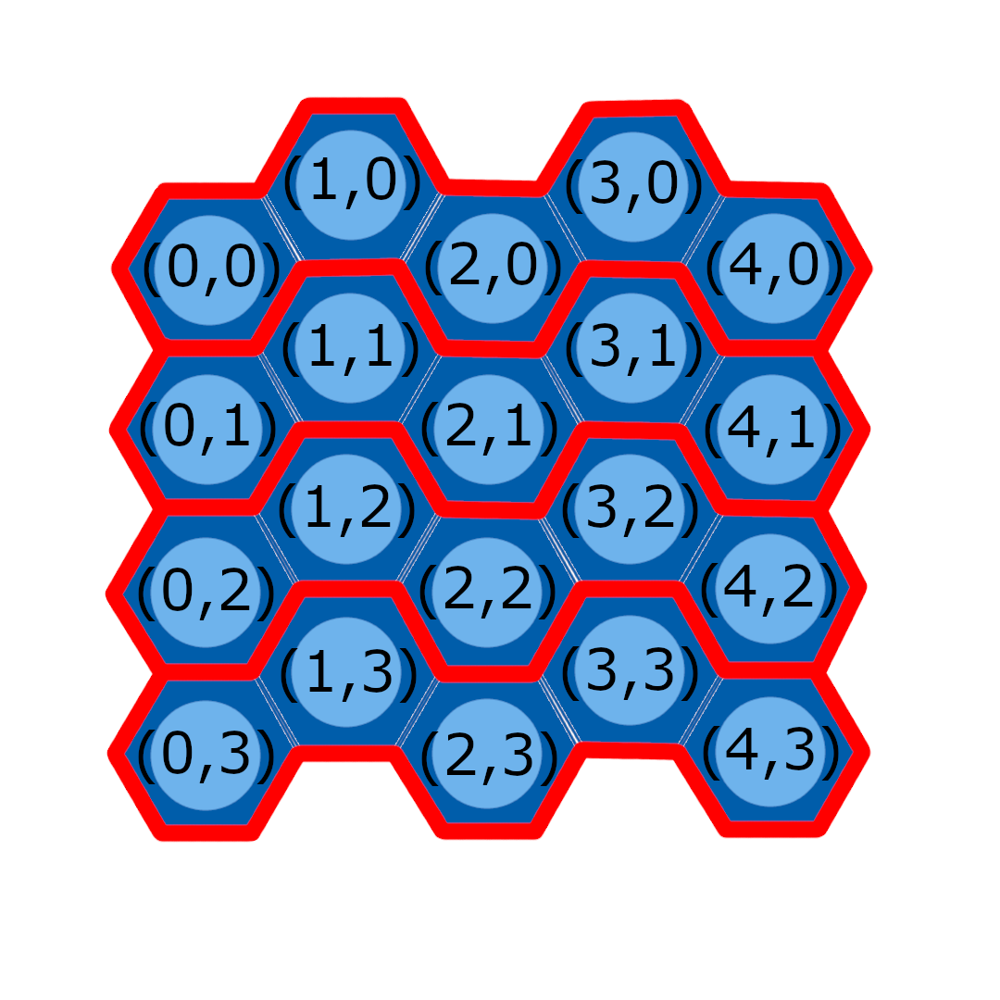
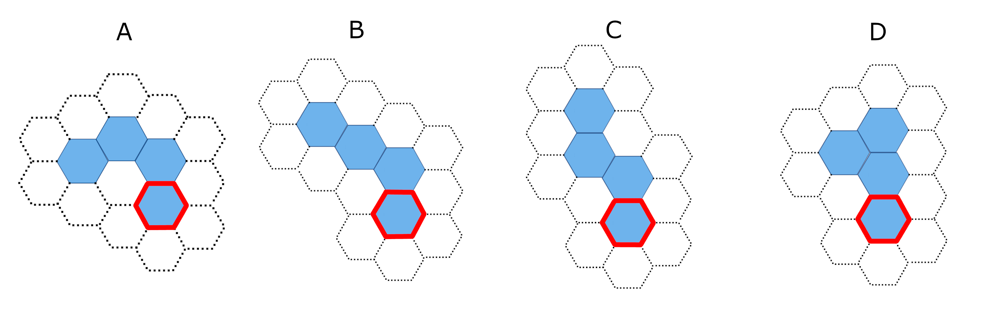
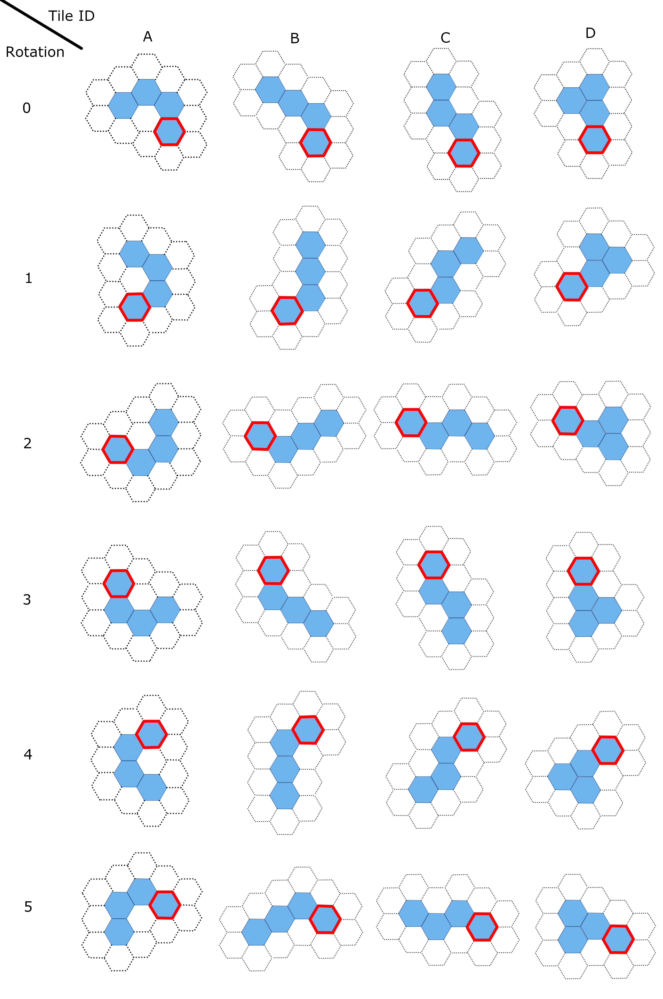
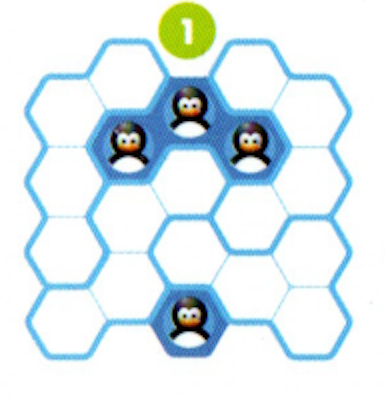

# Penguins and ice
## Overview

The assignment is based on a simple children's puzzle called [Penguins Pool Party](https://www.smartgames.eu/uk/one-player-games/penguins-pool-party),
made by [SmartGames](http://www.smartgames.eu/), a producer of educational games. The design of the game and all imagery in this assignment comes from their
Penguins Pool Party game.

The game comes with 60 pre-defined challenges, organised into four
difficulty levels from *starter* to *master*. Each challenge defines how
many penguins are on the board, and their positions.

The first challenge from the game booklet is shown below:

The objective of the game is to place all of the four ice blocks on the game
board, without covering any of the penguins or any of the other ice blocks.

We provide you with a [paper version of the game](assets/papergame.pdf),
which you can print out to help you visualise the game if you wish.

### Board

The board is a 5 x 4 hexagonal grid. Below is a depiction of the board, along
with each hexagon's Cartesian coordinates:

Notice that, because of the shape of hexagons, odd-numbered columns (that is, 1
and 3) are slightly offset from their even counterparts. Taking this offset
into account, let's treat "rows" on this board as such:

where the red lines separate rows from one another. You can verify that these
lines separate rows yourself by checking the second entry of each coordinate,
which denotes the y-coordinate of that hexagon. The hexagons inside the same
red boundary should all have the same y-coordinate.

If you are interested in computational representations of hexagons, you might
like to consult [this resource](https://www.redblobgames.com/grids/hexagons/).
While it complements the content in this assignment, this readme and the course
content should be sufficient for you to be able to start this assignment.

### Pieces

The game has four identical penguin pieces and four differently-shaped
ice blocks. 

Each penguin takes up one hexagon on the game board, while each 
ice block takes up four hexagons on the game board. It is not necessary
for all four penguin pieces to be on the board, but all four ice blocks must be
placed on the board to solve the game.

Each ice block has the following information:
* A one-letter ID (out of 'A', 'B', 'C' and 'D');
* A set of coordinates denoting the piece's origin; and
* The rotation of the ice block.

Below is the representation of each ice block in this game, at rotation 0:

The blue hexagons make up the ice block. The white hexagons with a dotted
outline are there to make it easier to see the ice blocks in the context of
the board.

Each ice block contains a blue hexagon with a red outline. This hexagon is the
*origin* of the ice block. The coordinates of the other hexagons that make up
the ice block are relative to the coordinates of the origin.

Below is a chart with all rotations for every ice block:

You may want to hold onto this chart when completing this assignment. It may be
useful for problems related to the spatial reasoning aspects of this game. If
it is easier to remember, you can think of each rotation number *n* as
corresponding to the rotation of a piece such that its origin shares exactly
one edge with another hexagon in the same piece. This is the *n*-th edge from
the origin, where *n* = 0 is the top-most edge and successive values of *n*
move around the hexagon clockwise.

Note that piece C is symmetrical. When writing solutions in string form, *the
lower rotation number* is provided. This is because any instance of piece C
with a rotation number between 3 and 5 (inclusive) has an equivalent form with
a rotation number between 0 and 2, and a different set of origin coordinates.

The only information required to define the penguin pieces is their Cartesian
coordinates on the board.

### Challenges

The objective of the game is to place the four ice blocks on the game board,
without covering any of the penguins or any of the other ice blocks in the
water.

Each challenge defines how many penguins are on the board, and their positions.
Easier challenges use more penguins than the more difficult ones.

The challenge shown above contains four penguins: their Cartesian coordinates
are (2, 0), (1, 1), (3, 1) and (2, 3).

The game is complete when all four ice blocks are placed on the board,
such that no two blocks overlap, and no block covers a penguin.

## Encoding the Game

This section explains how certain elements of the game are encoded into
strings. While such an encoding is not necessary for designing software using
object orientation, the encoding and decoding used in this assignment will be
very similar to the work you will be doing in Assignment 2. Although this work
is done for you in the assignment, we encourage you to look at the methods that
have been written for encoding/decoding in this assignment. In particular, have
a look at the various `toString()` methods in the code.

### Initial State

The initial state of a challenge is defined only by the placement of penguins
on the board. Therefore, the initial state is a two- to eight-character string,
loosely defined as

``{first penguin coordinates}{second penguin coordinates}{third penguin coordinates}{fourth penguin coordinates}``

Each coordinate is two characters long: the first character corresponds to the
x-coordinate, and the second character corresponds to the y-coordinate. For
example, the challenge displayed [above](#overview) would be represented
in string form as

``20113123``.

Breaking this string up into `20`, `11`, `31` and `23` gives us the coordinates
of each penguin as mentioned in the [Challenges](#challenges) section.

Throughout each challenge, the convention is to order penguins first by
y-coordinate, then by x-coordinate. The order is ascending.

The string only encodes the positions of penguins on the board. If there are
some penguins not on the board, then their corresponding coordinate string is
empty.

### Solution

A solution is encoded by the placement of all four ice blocks on the board. A
*placement* of an ice block comprises the ice block's ID, the location of its
origin on the board, and the ice block's rotation. This is represented in
string format as

``{ID}{origin location}{rotation}``.

As an example, consider the solution to the challenge provided in the
[Objective](#objective) section of this readme:

In detail, this solution can be described as:

* A placement of ice block A at location (3, 2) and with rotation 1;
* A placement of ice block B at location (1, 0) and with rotation 4;
* A placement of ice block C at location (0, 3) and with rotation 1; and
* A placement of ice block D at location (2, 2) and with rotation 2.

Note that there is an alternative placement of piece C, in which its location
is (2, 1) and its rotation is 4. Because these two placements are equivalent,
we take the placement with the lower rotation number.

If you are struggling to understand the above dot points, or would like to read
more about the symmetry of piece C, please consult the ice
block rotation chart in the [Pieces](#pieces) section of this readme.

So, in string form, the solution to the first challenge would be denoted as

``"A321B104C031D222"``.

It is convention for solutions to be ordered alphabetically by ice block ID.
